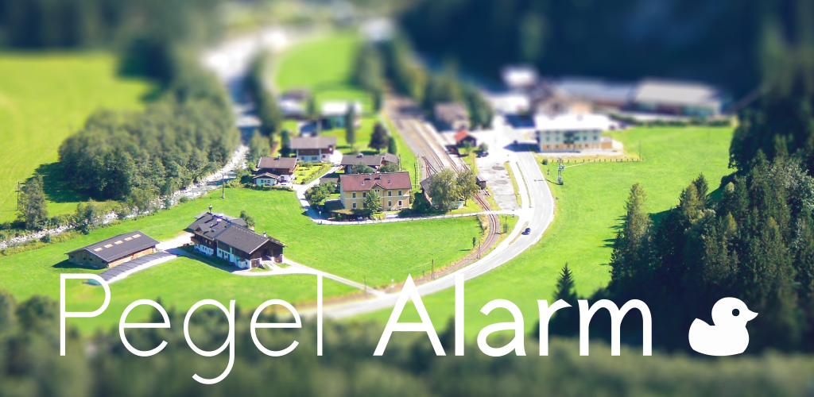

# Pegel Alarm



This repository contains the source for the Android application __Pegel Alarm__. Pegel Alarm helps people living in areas affected by floodings in Germany by providing alarms whenever rivers haven rise above user defined thresholds. For more info please visit [http://pegelalarm.de/](http://pegelalarm.de/) (in German).

### App setup

To get started with Pegel Alarm, you will first need to head over to the [Google Developer Console](https://console.developers.google.com), create a new project and enable the following APIs:

- Google Cloud Messaging for Android
- Google+ API

In addition you will need to setup 2 OAuth client ids, one for Pegel Alarm and one for the backend services (ODS + CEPS, see below).

Next head over to your local copy of the Pegel Alarm source and add the following string defintions, typically under `app/src/main/res/values/config.xml`:

```xml
<?xml version="1.0" encoding="utf-8"?>
<resources>
    <string name="google_project_id">...</string>
    <string name="google_oauth_web_client_id">...</string>
    <string name="ods_base_url">https://ods.cs.fau.de/ods/api/v1</string>
    <string name="ceps_base_url">https://ods.cs.fau.de/ceps/api/v1</string>
    <string name="google_analytics_property_id">...</string>
</resources>
```

- `google_project_id`: the id of the project you created above
- `google_oauth_web_client_id`: the id of the web (!) oauth client you created above


## Backend setup

Pegel Alarm uses a number of backend services to get the job done, most notably the [Open Data Service](https://github.com/jvalue/open-data-service) (ODS) and the [Complex Event Processing Service](https://github.com/jvalue/cep-service) (CEPS). Both need some configuration in order to work with Pegel Alarm.

### ODS setup

The ODS is responsible for fetching and providing water related data from various sources, such as [PegelOnline](http://pegelonline.wsv.de/gast/start). In order for the ODS to start pulling this data, the following source needs to the added to the ODS (see the ODS docs for more info about how to add sources):

- name: `pegelalarm`
- domainIdKey: `/gaugeId`
- schema:
```json
{
    "$schema": "http://json-schema.org/draft-04/schema#",
    "type": "object",
    "properties": {
      "gaugeId": {
        "type": "string"
      },
      "name": {
        "type": "string"
      },
      "km": {
        "type": "number"
      },
      "agency": {
        "type": "string"
      },
      "longitude": {
        "type": "number"
      },
      "latitude": {
        "type": "number"
      },
      "water": {
        "type": "string"
      },
      "currentMeasurement": {
        "type": "object",
        "properties": {
          "timestamp": {
            "type": "string"
          },
          "value": {
            "type": "number"
          },
          "trend": {
            "type": "integer"
          },
          "stateMnwMhw": {
            "type": "string"
          },
          "stateNswHsw": {
            "type": "string"
          },
          "characteristicValues": {
            "type": "array",
            "items": {
              "type": "object",
              "properties": {
                "shortname": {
                  "type": "string"
                },
                "longname": {
                  "type": "string"
                },
                "unit": {
                  "type": "string"
                },
                "value": {
                  "type": "integer"
                },
                "validFrom": {
                  "type": "string"
                },
                "timespanStart": {
                  "type": "string"
                },
                "timespanEnd": {
                  "type": "string"
                },
                "occurrences": {
                  "type": "array",
                  "items": {
                    "type": "string"
                  }
                }
              }
            }
          }
        }
      }
    }
  }
```

This will create a source object on the ODS but does not yet start pulling data from anywhere. To do that you will need to add a filter chain to the newly created source. The body usually looks like this:

```json
{
  "processors" : [
    {
      "name" : "JsonSourceAdapter",
      "arguments" : {
        "sourceUrl" : "http://pegelonline.wsv.de/webservices/rest-api/v2/stations.json?includeTimeseries=true&includeCurrentMeasurement=true&includeCharacteristicValues=true"
      }
    },
    {
      "name" : "PegelOnlineMerger",
      "arguments" : { }
    },
    {
      "name" : "DbInsertionFilter",
      "arguments" : {
        "updateData" : true
      }
    },
    {
      "name" : "NotificationFilter",
      "arguments" : { }
    }
  ],
    "executionInterval" : {
    "period" : 1,
    "unit" : "MINUTES"
  }
}
```

### CEPS setup

The CEPS is responsible for tracking and evaluting user defined rules and uses the ODS as a basis for data. In the case of Pegel Alarm the CEPS handles rules which trigger whenever water levels have risen above or below user defined thresholds. If such an event is triggered it will use Google Cloud Messaging (GCM) to notify the corresponding Android device about the news.

By default the CEPS does not know anything about the ODS and hence needs to be configured to receive data from it. This is done by adding a source with the same id as on the ODS to CEPS, so in our case `pegelalarm`.

Next the CEPS requires two EPL (event processing language) adapters which represent the "rules" that clients of the CEPS can use. The adpaters are:

- `pegelAlarmAboveLevel` with a body of
```json
{
    "eplBlueprint": "select station1, station2 from pattern [ every station1=`pegelalarm` ( gaugeId = 'GAUGE_ID' ) -> station2=`pegelalarm` ( gaugeId = 'GAUGE_ID' ) ] where station1.currentMeasurement.value <= LEVEL and station2.currentMeasurement.value > LEVEL",
    "requiredArguments": {
        "GAUGE_ID": "STRING",
        "LEVEL": "NUMBER"
    }
}
```
- `pegelAlarmBelowLevel` with a body of
```json
{
    "eplBlueprint": "select station1, station2 from pattern [ every station1=`pegelalarm` ( gaugeId = 'GAUGE_ID' ) -> station2=`pegelalarm` ( gaugeId = 'GAUGE_ID' ) ] where station1.currentMeasurement.value >= LEVEL and station2.currentMeasurement.value < LEVEL",
    "requiredArguments": {
        "GAUGE_ID": "STRING",
        "LEVEL": "NUMBER"
    }
}
```

## License

Copyright 2014 Philipp Eichhorn  
Copyright 2014, 2015 Friedrich-Alexander Universität Erlangen-Nürnberg

Licensed under the Apache License, Version 2.0 (the "License");
you may not use this file except in compliance with the License.
You may obtain a copy of the License at

[http://www.apache.org/licenses/LICENSE-2.0](http://www.apache.org/licenses/LICENSE-2.0)

Unless required by applicable law or agreed to in writing, software
distributed under the License is distributed on an "AS IS" BASIS,
WITHOUT WARRANTIES OR CONDITIONS OF ANY KIND, either express or implied.
See the License for the specific language governing permissions and
limitations under the License.
